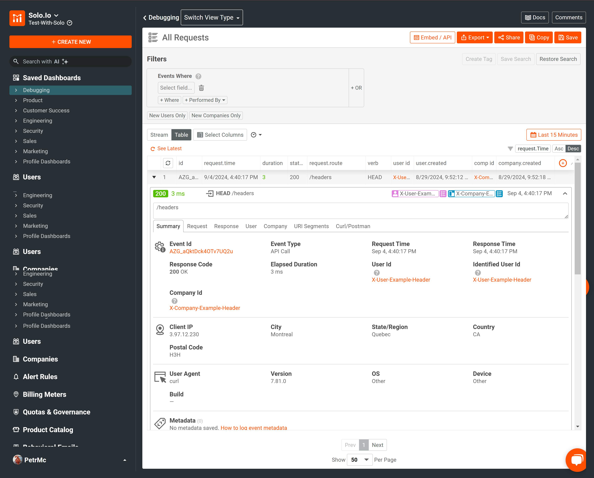

# Gloo Gateway Example

This guide outlines the steps required to configure an environment that uses the ExtProc Moesif plugin to collect API call data flowing through Solo.io's Gloo Gateway.

## Prerequisites

To run this example, ensure you have the following:

- A Kubernetes cluster set up
- A kubeconfig context pointing to your cluster

Additionally, you will need the following command-line tools:

- **kubectl**: The Kubernetes CLI. Ensure it matches the Kubernetes cluster version (within one minor version).
- **helm**: The Kubernetes package manager for deploying Gloo Gateway. While there are multiple installation options, Helm is recommended for proof-of-concept setups.
- **envsubst**: Required to manage environment variable substitution within the provided YAML files.

## Set Environment Variables

You will need credentials from both Moesif and Solo.io:

- Moesif Application ID
- Gloo Gateway License Key (for questions, [contact an account representative](https://www.solo.io/company/contact-sales/))

To set these environment variables, run the following commands:

```bash
export GLOO_GATEWAY_LICENSE_KEY=<your-license-key>
export MOESIF_APP_ID=<your-moesif-app-id>
```

## Deploy Gloo Gateway Enterprise Edition

Follow the steps outlined in the [Gloo Gateway Documentation (Enterprise Edition)](https://docs.solo.io/gateway/latest/quickstart/#install-gloo-gateway) to install the Gloo Gateway in your current Kubernetes cluster context.

1. **Install Kubernetes Gateway API CRDs**:
   Install the necessary Custom Resource Definitions (CRDs) for the Gateway API:

   ```bash
   kubectl apply -f https://github.com/kubernetes-sigs/gateway-api/releases/download/v1.0.0/standard-install.yaml
   ```

   Example output:

   ```output
   customresourcedefinition.apiextensions.k8s.io/gatewayclasses.gateway.networking.k8s.io created
   customresourcedefinition.apiextensions.k8s.io/gateways.gateway.networking.k8s.io created
   customresourcedefinition.apiextensions.k8s.io/httproutes.gateway.networking.k8s.io created
   customresourcedefinition.apiextensions.k8s.io/referencegrants.gateway.networking.k8s.io created
   ```

2. **Add and update the Helm repository for Gloo Gateway Enterprise Edition:**

   ```bash
   helm repo add glooe https://storage.googleapis.com/gloo-ee-helm
   helm repo update
   ```

3. **Install Gloo Gateway using the following Helm command:**

   ```bash
   helm install -n gloo-system gloo-gateway glooe/gloo-ee \
   --create-namespace \
   --version 1.17.1 \
   --set-string license_key=$GLOO_GATEWAY_LICENSE_KEY \
   --set gloo.kubeGateway.enabled=true \
   --set gloo.gloo.disableLeaderElection=true \
   --set gloo.discovery.enabled=false \
   --set observability.enabled=false \
   --set prometheus.enabled=false \
   --set grafana.defaultInstallationEnabled=false \
   --set gloo-fed.enabled=false \
   --set gloo-fed.glooFedApiserver.enable=false \
   --set gloo.gatewayProxies.gatewayProxy.disabled=true
   ```
   
   Example output:
   
   ```output
   NAME: gloo-gateway
   LAST DEPLOYED: Wed Sep  4 16:35:19 2024
   NAMESPACE: gloo-system
   STATUS: deployed
   REVISION: 1
   TEST SUITE: None
   ```

## Apply Ingress Gateway Definition

Follow the Solo Gloo Gateway [Documentation](https://docs.solo.io/gateway/latest/quickstart/#set-up-an-api-gateway) to create a gateway resource and configure an HTTP listener using the Kubernetes Gateway API. This gateway will serve HTTP resources from all namespaces.

```bash
kubectl apply -n gloo-system -f- <<EOF
kind: Gateway
apiVersion: gateway.networking.k8s.io/v1
metadata:
  name: http
spec:
  gatewayClassName: gloo-gateway
  listeners:
  - protocol: HTTP
    port: 8080
    name: http
    allowedRoutes:
      namespaces:
        from: All
EOF
```

## Deploy HTTPBin (Demo Application)

As part of the [Gloo Gateway Quick Start Guide](https://docs.solo.io/gateway/latest/quickstart/#deploy-a-sample-app):

```bash
kubectl create ns httpbin
kubectl -n httpbin apply -f https://raw.githubusercontent.com/solo-io/gloo-mesh-use-cases/main/policy-demo/httpbin.yaml
```

## Expose HTTPBin Service

Expose `HTTPBin` using an `HTTPRoute` resource. The following example exposes the app on the `www.example.com` domain.

```bash
kubectl apply -f- <<EOF
apiVersion: gateway.networking.k8s.io/v1beta1
kind: HTTPRoute
metadata:
  name: httpbin
  namespace: httpbin
  labels:
    example: httpbin-route
spec:
  parentRefs:
    - name: http
      namespace: gloo-system
  hostnames:
    - "www.example.com"
  rules:
    - backendRefs:
        - name: httpbin
          port: 8000
EOF
```

## Deploy Moesif ExtProc Plugin

Deploy the Moesif ExtProc plugin by applying the Kubernetes `Deployment` and `Service` resources. This also includes the `Upstream` manifest to allow Gloo Gateway to access the plugin.

```bash
envsubst < examples/extproc/extproc.yaml | kubectl apply -f -
```

## Enable ExtProc in Gloo Gateway

To apply the ExtProc HTTP Filter to incoming traffic, run the following command:
(This command merges the provided settings YAML to enable the Moesif ExtProc plugin)

```bash
kubectl patch settings default -n gloo-system --type='merge' --patch "$(cat examples/extproc/extproc-gloo-settings.yaml)"
```

## Send a Request to HTTPBin (Cloud Provider)

If your Kubernetes cluster is hosted by a cloud provider (AWS, Azure, GCP), obtain the public address of the load balancer:

```bash
export INGRESS_GW_ADDRESS=$(kubectl get svc -n gloo-system gloo-proxy-http -o=jsonpath="{.status.loadBalancer.ingress[0]['hostname','ip']}")
echo $INGRESS_GW_ADDRESS
```

Send a request to `HTTPBin` service using the public address and verify that you get a `200` HTTP response. Note that it might take a few seconds for the load balancer to become fully ready.

```bash
curl -I http://$INGRESS_GW_ADDRESS:8080/headers -H "host: www.example.com"
```

Example output:

```output
curl -I http://$INGRESS_GW_ADDRESS:8080/headers -H "host: www.example.com"
HTTP/1.1 200 OK
access-control-allow-credentials: true
access-control-allow-origin: *
content-type: application/json; encoding=utf-8
date: Wed, 04 Sep 2024 23:38:34 GMT
x-envoy-upstream-service-time: 2
server: envoy
transfer-encoding: chunked
```

## Send a Request to HTTPBin (Locally Hosted Cluster)

If the cluster is running locally or in an on-prem datacenter, expose the service on your local machine:

```bash
kubectl port-forward deployment/gloo-proxy-http -n gloo-system 8080:8080&
```

Send a request to the locally exposed `HTTPBin` service, and verify that you get a `200` HTTP response code.

```bash
curl -I localhost:8080/headers -H "host: www.example.com"
```

Example output:

```output
$ curl -I localhost:8080/headers -H "host: www.example.com"
Handling connection for 8080
HTTP/1.1 200 OK
access-control-allow-credentials: true
access-control-allow-origin: *
content-type: application/json; encoding=utf-8
date: Wed, 04 Sep 2024 23:40:17 GMT
x-envoy-upstream-service-time: 2
server: envoy
transfer-encoding: chunked
```

## Confirm Plugin Functionality

Access the [Moesif Dashboard](https://www.moesif.com/wrap) to confirm that traffic is being received by the Moesif platform. A sample request log should look like this:



**Note:** If you don't receive a `200` response or don't see your requests registered in Moesif dashboard, follow the troubleshooting steps at the bottom of this document.

## Troubleshooting

If results differ from the expected output, the following commands can help identify the issue:

- Confirm Gloo Gateway is running:

  ```bash
  kubectl get pods -n gloo-system | grep gloo
  ```

  Example output:

  ```output
  gloo-7c44b5b98-tl9mm                    1/1     Running   0          12m
  gloo-proxy-http-66d5887847-n7nqx        1/1     Running   0          11m
  ```

- Verify that the `gloo-gateway` GatewayClass is created:

  ```bash
  kubectl get gatewayclass gloo-gateway
  ```
  
  Example output:
  
  ```output
  NAME           CONTROLLER             ACCEPTED   AGE
  gloo-gateway   solo.io/gloo-gateway   True       13m
  ```

  **Note:** If the GatewayClass is not created, ensure that the installation of Gloo Gateway was successful, and check for any errors in the Helm installation logs.

- Confirm the gateway is created and assigned an external address:

  ```bash
  kubectl get gateway http -n gloo-system
  ```
  
  Example output:
  
  ```output
  NAME   CLASS          ADDRESS                                                                  PROGRAMMED   AGE
  http   gloo-gateway   a3a6c06e2f4154185bf3f8af46abf22e-139567718.us-east-2.elb.amazonaws.com   True         93s
  ```

- Verify the `HTTPBin` application is running:

  ```sh
  kubectl -n httpbin get pods
  ```

  Example output:
  
  ```output
  NAME                      READY   STATUS    RESTARTS   AGE
  httpbin-d57c95548-nz98t   3/3     Running   0          18s
  ```

- Check the status of the `HTTPRoute` for `HTTPBin` service:

  ```sh
  kubectl get -n httpbin httproute/httpbin -o yaml
  ```
  
  Example output of status section (note `Accepted`, `ResolvedRefs` and `status` reporting `true`):
  
  ```
  status:
    parents:
    - conditions:
      - lastTransitionTime: "2024-09-04T23:37:03Z"
        message: ""
        observedGeneration: 1
        reason: Accepted
        status: "True"
        type: Accepted
      - lastTransitionTime: "2024-09-04T23:37:03Z"
        message: ""
        observedGeneration: 1
        reason: ResolvedRefs
        status: "True"
        type: ResolvedRefs
      controllerName: solo.io/gloo-gateway
      parentRef:
        group: gateway.networking.k8s.io
        kind: Gateway
        name: http
        namespace: gloo-system
  ```

- Check if the Moesif plugin pod is running:

  ```bash
  kubectl -n gloo-system get pods -l app=moesif-extproc-plugin
  ```

  Example output:
  
  ```output
  NAME                                    READY   STATUS    RESTARTS   AGE
  moesif-extproc-plugin-7dc9fbfd5c-px4xg   1/1     Running   0          29m
  ```

- For more detailed troubleshooting, check the plugin logs with:

  ```bash
  kubectl -n gloo-system logs <pod name from the previous output>
  ```

You can modify the `RUST_LOG` environment variable in the deployment under `spec.containers.env` to `TRACE`. This will trigger a new pod deployment. `RUST_LOG` sets the logging level for the Rust-based Moesif plugin, and setting it to `TRACE` provides highly detailed logs, useful for debugging traffic flow issues. You can observe the updated logs by viewing the new pod logs after deployment using the previous kubectl logs command
